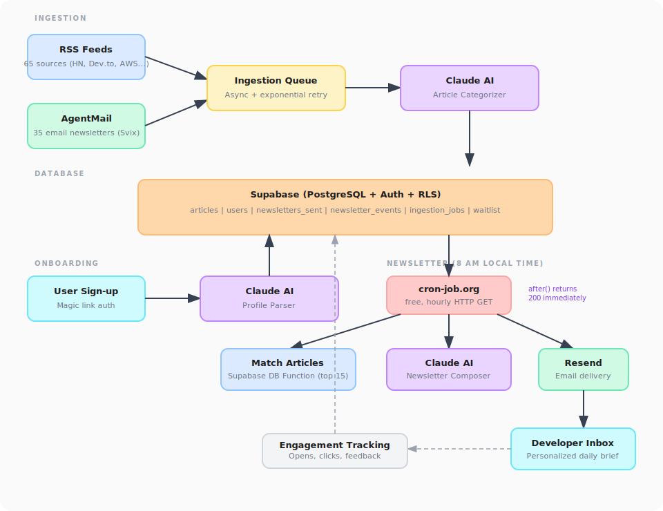

<p align="center">
  <code><b>skillfeed_</b></code>
  <br />
  <br />
  <p align="center">
    Stop reading duplicate articles. Get the one brief that matters.
    <br />
    <br />
    <a href="https://nextjs.org"></a>
    <a href="https://www.typescriptlang.org"></a>
    <a href="https://supabase.com"></a>
    <a href="https://docs.anthropic.com"></a>
    <a href="https://tailwindcss.com"></a>
    <a href="https://bun.sh"></a>
    <br />
    <br />
    <a href="#getting-started"><strong>Get Started</strong></a>
    &nbsp;&middot;&nbsp;
    <a href="#architecture"><strong>Architecture</strong></a>
    &nbsp;&middot;&nbsp;
    <a href="#api-reference"><strong>API Reference</strong></a>
    &nbsp;&middot;&nbsp;
    <a href="#deployment"><strong>Deploy</strong></a>
  </p>
</p>

<br />

## About

SkillFeed is an AI-powered newsletter aggregator that delivers **one personalized daily brief** to developers. It ingests content from 100+ sources (65 RSS feeds and 35 email newsletters), categorizes articles using Claude AI, and matches them to each user's skills, role, and career goals. Newsletters are delivered at **8 AM in each user's local timezone**.

### Key Features

- **AI-Powered Curation** - Claude categorizes articles by role, level, and keywords, then composes personalized newsletters with "why it matters" context
- **Smart Matching** - Supabase Database Function matches articles using role overlap, level compatibility, and keyword intersection
- **Timezone-Aware Delivery** - Newsletters arrive at 8 AM in each user's local timezone, powered by an hourly cron via [cron-job.org](https://cron-job.org) (free)
- **Multi-Source Ingestion** - Pulls from 65 RSS feeds and 35 email newsletters via AgentMail webhooks
- **Engagement Tracking** - Open rates, click tracking, and per-article feedback (helpful / not helpful)
- **One-Click Unsubscribe** - JWT-based unsubscribe with `List-Unsubscribe` header support

### Built With

- [Next.js 16](https://nextjs.org) - App Router, React 19, Server Components
- [Supabase](https://supabase.com) - PostgreSQL, Auth, Row Level Security
- [Claude API](https://docs.anthropic.com) - Article categorization, profile parsing, newsletter composition
- [Resend](https://resend.com) + [MJML](https://mjml.io) - Transactional email delivery
- [AgentMail](https://agentmail.to) - Email ingestion with Svix webhook verification
- [cron-job.org](https://cron-job.org) - Free external cron for hourly newsletter scheduling
- [Tailwind CSS v4](https://tailwindcss.com) + [ShadCN UI](https://ui.shadcn.com) - Component library
- [Bun](https://bun.sh) - Runtime and package manager

<br />

## Architecture

<p align="center">
  
</p>

### Data Flow

1. **Ingest** - 65 RSS feeds and 35 email newsletters arrive via AgentMail webhooks (Svix-verified). Articles enter an async queue with exponential backoff retry.
2. **Categorize** - Claude AI extracts title, summary, takeaway, level, roles, keywords, and URL from each article.
3. **Schedule** - Every hour, cron-job.org pings the API. A Supabase Database Function (`get_users_due_for_newsletter`) finds users where it's currently 8 AM in their timezone.
4. **Match** - The `match_articles_for_user()` Database Function finds the top 15 unread articles from the last 7 days matching each user's profile.
5. **Compose** - Claude generates a personalized newsletter: featured articles with "why it matters" context and a learning roadmap.
6. **Deliver** - Next.js `after()` returns 200 immediately, then Resend sends the email with HMAC-signed tracking pixels, click tracking, and feedback URLs in the background.

<br />

## Project Structure

```
src/
├── app/                              # Next.js App Router
│   ├── page.tsx                      # Landing page
│   ├── login/                        # Magic link authentication
│   ├── onboarding/                   # Multi-step profile setup
│   ├── dashboard/                    # User dashboard
│   ├── newsletters/[id]/            # View past newsletters
│   ├── auth/                         # Callback + sign out routes
│   └── api/
│       ├── users/                    # Profile CRUD (POST, GET, PATCH)
│       ├── newsletters/generate/     # Single user newsletter generation
│       ├── newsletters/generate-all/ # Hourly cron (8 AM per timezone)
│       ├── webhooks/agentmail/       # Email ingestion endpoint
│       ├── metrics/                  # Open, click, feedback tracking
│       └── unsubscribe/              # JWT-based one-click unsubscribe
│
├── components/
│   ├── landing/                      # Hero, features, how-it-works, CTA, marquee
│   ├── dashboard/                    # Profile summary, newsletter cards/list
│   ├── onboarding/                   # Profile form, role selector
│   ├── shared/                       # Header, footer
│   └── ui/                           # ShadCN primitives
│
├── emails/
│   └── newsletter-template.ts        # MJML email template
│
├── lib/
│   ├── agents/                       # AI agents
│   │   ├── article-categorizer.ts    # Article → structured data
│   │   ├── newsletter-composer.ts    # Articles + profile → newsletter
│   │   ├── newsletter-composer-factory.ts  # LLM vs template mode routing
│   │   └── profile-parser.ts         # Resume → structured profile
│   ├── supabase/                     # Admin, server, browser clients
│   ├── queue/                        # Async ingestion with retry
│   ├── metrics/                      # HMAC-signed tracking URLs
│   ├── claude/                       # Unified LLM client (Claude + Gemini)
│   ├── rss/                          # RSS feed ingestion (65 feeds)
│   ├── auth/                         # Session helpers
│   └── utils/                        # Types, constants, rate limiter
│
└── middleware.ts                     # Route protection

supabase/migrations/                  # 17 sequential SQL migrations
scripts/                              # setup-agentmail, seed-data, ingest-rss, newsletter-subscribe-list
```

<br />

## Database Schema

| Table | Purpose |
|-------|---------|
| `articles` | Ingested articles with `roles[]`, `keywords[]`, `level`, `processing_status` |
| `users` | Developer profiles with current/target roles, skills, learning goals, timezone |
| `newsletters_sent` | Delivered newsletters with `article_ids[]`, delivery status, HTML content |
| `newsletter_events` | Engagement tracking: opens, clicks, feedback per article |
| `ingestion_jobs` | Async processing queue with retry logic (max 5 attempts) |
| `waitlist` | Early access gating (pending/approved/rejected) |

**Key Database Functions:**
- `match_articles_for_user(user_id)` - Returns the top 15 matching unread articles from the last 7 days, scored by keyword overlap, filtered by role and level compatibility
- `get_users_due_for_newsletter(target_hour)` - Returns users where it's currently the target hour in their local timezone and they haven't been sent a newsletter today

<br />

## Getting Started

### Prerequisites

- [Bun](https://bun.sh) v1.0+
- [Supabase](https://supabase.com) project (free tier works)
- [Anthropic](https://console.anthropic.com) API key
- [Resend](https://resend.com) API key
- [AgentMail](https://agentmail.to) account (optional, for email ingestion)

### Installation

```bash
# Clone the repository
git clone git@github.com:Nancy-Chauhan/skillfeed.git
cd skillfeed

# Install dependencies
bun install

# Configure environment
cp .env.example .env.local
```

Fill in `.env.local` with your API keys:

```env
NEXT_PUBLIC_SUPABASE_URL=https://your-project.supabase.co
NEXT_PUBLIC_SUPABASE_ANON_KEY=...
SUPABASE_SERVICE_ROLE_KEY=...
ANTHROPIC_API_KEY=sk-ant-...
RESEND_API_KEY=re_...
AGENTMAIL_API_KEY=...
AGENTMAIL_WEBHOOK_SECRET=...
CRON_SECRET=...          # Random string for cron auth
JWT_SECRET=...           # Random string for unsubscribe tokens
NEXT_PUBLIC_APP_URL=http://localhost:3000
```

### Database Setup

Run the migrations in order in your Supabase SQL editor:

```bash
supabase/migrations/001_enable_extensions.sql       # pgcrypto
supabase/migrations/002_create_articles.sql         # Articles table + enums
supabase/migrations/003_create_users.sql            # Users table
supabase/migrations/004_create_newsletters.sql      # Newsletters sent
supabase/migrations/005_create_functions.sql        # match_articles_for_user()
supabase/migrations/006_create_indexes.sql          # GIN + B-tree indexes
supabase/migrations/007_enable_rls.sql              # Row Level Security policies
supabase/migrations/008_create_ingestion_jobs.sql   # Async queue
supabase/migrations/009_create_newsletter_events.sql # Engagement tracking
supabase/migrations/010_create_waitlist.sql         # Waitlist table
supabase/migrations/011_expand_user_roles.sql       # Extended role enums
supabase/migrations/012_require_article_url.sql     # URL required constraint
supabase/migrations/013_add_custom_roles.sql        # Custom role support
supabase/migrations/014_add_article_takeaway.sql    # Article takeaway field
supabase/migrations/015_update_match_function.sql   # Improved matching
supabase/migrations/016_create_role_labels.sql      # Role display labels
supabase/migrations/017_timezone_newsletter_scheduling.sql # Timezone-aware scheduling
```

### Run

```bash
# Start development server
bun run dev

# Seed test articles (optional)
bun run scripts/seed-test-data.ts

# Ingest from RSS feeds (65 sources)
bun run scripts/ingest-rss.ts

# View email newsletter subscribe list (35 sources)
bun run scripts/newsletter-subscribe-list.ts

# Set up AgentMail inbox (optional)
bun run scripts/setup-agentmail.ts
```

<br />

## API Reference

### Newsletter Generation

| Method | Endpoint | Auth | Description |
|--------|----------|------|-------------|
| `POST` | `/api/newsletters/generate` | `Bearer CRON_SECRET` | Generate and send newsletter for a single user |
| `GET/POST` | `/api/newsletters/generate-all` | `Bearer CRON_SECRET` | Hourly cron: process users due at 8 AM local time |
| `POST` | `/api/cron/ingest` | `Bearer CRON_SECRET` | Ingest RSS feeds + process email queue |

```bash
# Send newsletter to a specific user
curl -X POST http://localhost:3000/api/newsletters/generate \
  -H "Content-Type: application/json" \
  -H "Authorization: Bearer $CRON_SECRET" \
  -d '{"userId": "<uuid>"}'
```

### User Management

| Method | Endpoint | Auth | Description |
|--------|----------|------|-------------|
| `POST` | `/api/users` | Session | Create profile (triggers AI parsing) |
| `GET` | `/api/users/[id]` | Session | Get user profile |
| `PATCH` | `/api/users/[id]` | Session | Update profile (re-parses if resume changes) |

### Webhooks & Tracking

| Method | Endpoint | Auth | Description |
|--------|----------|------|-------------|
| `POST` | `/api/webhooks/agentmail` | Svix signature | Receive inbound newsletter emails |
| `GET` | `/api/metrics/open` | HMAC | 1x1 tracking pixel for email opens |
| `GET` | `/api/metrics/click` | HMAC | Click tracking with redirect |
| `GET` | `/api/metrics/feedback` | HMAC | Per-article helpful/not helpful |
| `GET` | `/api/unsubscribe` | JWT | One-click unsubscribe |

<br />

## Deployment

### Vercel (Recommended)

1. Push to GitHub
2. Import project in [Vercel](https://vercel.com)
3. Add all environment variables from `.env.example`
4. Deploy
5. Set up [cron-job.org](https://cron-job.org) (free) to hit `/api/newsletters/generate-all` every hour with `Authorization: Bearer <CRON_SECRET>` header
6. Set up a second cron for `/api/cron/ingest` every 6 hours

### Environment Variables

| Variable | Description |
|----------|-------------|
| `NEXT_PUBLIC_SUPABASE_URL` | Supabase project URL |
| `NEXT_PUBLIC_SUPABASE_ANON_KEY` | Supabase anonymous key |
| `SUPABASE_SERVICE_ROLE_KEY` | Supabase service role key (server-side only) |
| `ANTHROPIC_API_KEY` | Claude API key (primary LLM) |
| `GEMINI_API_KEY` | Google Gemini API key (optional fallback LLM) |
| `RESEND_API_KEY` | Resend API key for sending emails |
| `EMAIL_FROM` | Sender address (e.g. `SkillFeed <hello@skillfeed.dev>`) |
| `AGENTMAIL_API_KEY` | AgentMail API key |
| `AGENTMAIL_WEBHOOK_SECRET` | Svix webhook verification secret |
| `CRON_SECRET` | Bearer token for cron job authentication |
| `JWT_SECRET` | Secret for signing unsubscribe tokens |
| `NEXT_PUBLIC_APP_URL` | Public app URL for tracking links |

<br />

## License

This project is proprietary and not open for redistribution.
